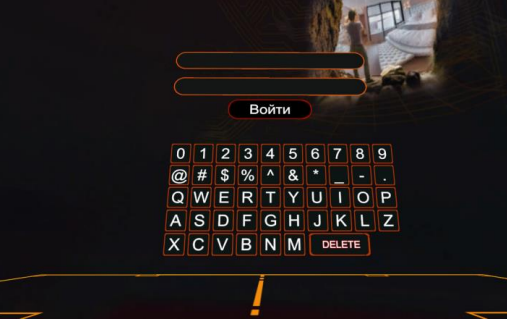
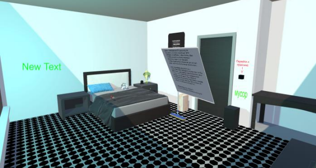
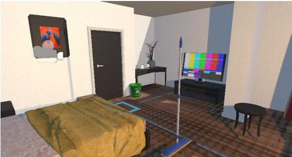
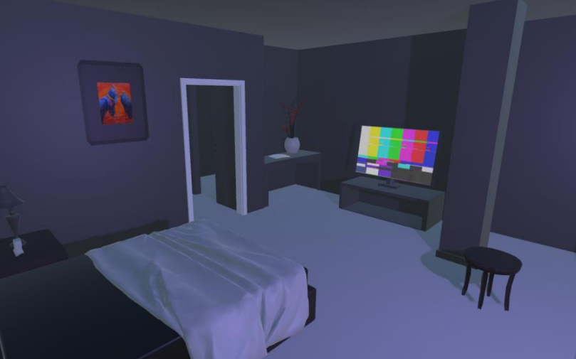

# Hotel Room Preparation VR Simulator (SteamVR & Unity)

This VR simulator, developed with SteamVR and Unity, is designed to train hotel staff in preparing rooms for guest check-in. The application provides a realistic, interactive environment where users can practice cleaning and organizing hotel rooms through immersive VR technology. The simulator includes various modules for training, practice, and evaluation, ensuring that users gain hands-on experience and receive feedback on their performance.

##

## Features

### Authentication Module
- **Secure Access**: Users must log in using their credentials (login and password) on the start screen, ensuring that only authorized personnel can access the simulator.
- **Role-Based Access**: Depending on the user’s role (staff or administrator), different scenes are loaded after login:
  - **Staff**: Taken to the training module to learn basic VR controls and interactions.
  - **Administrator**: Granted access to an interface showing all non-administrator users and their practice sessions.

  

### Training Module
- **Introduction to VR Mechanics**: Users enter the training scene to familiarize themselves with the simulator’s mechanics, such as cleaning the floor and collecting items using VR controllers.
- **Free Exploration**: This module allows users to freely explore the environment and practice basic tasks, such as mopping floors and organizing objects, using VR interactions.
  
  

### Practice Module
- **Realistic Practice Scenarios**: Users apply what they learned in training by completing tasks similar to those they will encounter on the job, such as cleaning floors and arranging items in the virtual room.
- **Data Logging**: The system records details about each practice session, including the cleaned zones, item positions, number of objects, and completion time.
- **Session Completion**: After finishing a practice session, users can save their progress by interacting with a designated button, which uploads the session data to the database.

  

### Review Module (Admin-Only)
- **Session Review and Evaluation**: Administrators can review session details for each user. This includes viewing cleaned zones, item positions, and other recorded session data to evaluate the user's performance.
- **Visual Indicators**: Admins can use controller buttons for enhanced visualization:
  - **Button X**: Highlights cleaned areas in green and uncleaned areas in red.
  - **Button Y**: Displays the recorded positions of objects within the room.
- **Detailed Assessment**: Administrators can use these visual tools to assess the user’s performance and provide feedback.

  

## Database Integration

The simulator includes a comprehensive electronic journal database to store and manage practice data. The database contains various tables and fields designed to track users, practice sessions, and the state of virtual objects. Key data stored includes:

- **User Information**: Stores details about each user and their roles.
- **Practice Sessions**: Logs session timestamps, cleaned zones, item positions, and the user who completed each session.

This structure ensures a robust data system, allowing administrators to monitor progress and analyze each user’s work in detail.

## How It Works

1. **Authentication**: Users log in on the start screen by entering their login and password. Based on the user’s role:
   - Non-admins are directed to the training module.
   - Admins access a user management interface with a list of all non-admin users.

2. **Training Module**: Non-admin users start in the training scene, where they can explore and learn basic VR interactions.

3. **Transition to Practice**: After familiarizing themselves with the controls, users enter the practice module by interacting with a black square button on the wall, which triggers the transition to the practice scene.

4. **Practice Module**: Users complete their cleaning tasks, such as mopping floors and organizing items. Once done, they save their progress by interacting with the designated button, which uploads the session data to the database.

5. **Administrator Review**: Admins can select a user and review their practice sessions. Each session displays detailed information, including cleaned areas and object positions. Admins can visually assess the user’s work with the help of color-coded indicators and spatial data.

## User Roles and Permissions

- **Administrator**: Manages users, reviews practice sessions, and evaluates performance. Has access to session data with visual indicators for detailed analysis.
- **Hotel Staff**: Participates in training and practice modules, performing tasks to prepare a room for guest check-in.

## Getting Started

1. Clone the repository and open the project in Unity.
2. Set up the database for user authentication and session logging.
3. Build and deploy the VR application using SteamVR-compatible hardware.

## Usage

In the app, users can:

- Log in securely and access role-specific functionalities.
- Train in VR on essential room preparation tasks in the training module.
- Practice preparing a virtual hotel room and save their progress.
- (Admins only) Review user sessions, using visual tools to evaluate task performance.

---

# VR Тренажер для Подготовки Номера в Отеле (SteamVR и Unity)

Этот VR тренажёр разработан с использованием SteamVR и Unity для обучения персонала отеля подготовке номеров к заселению гостей. Приложение предоставляет реалистичную, интерактивную среду, где пользователи могут тренироваться в уборке и организации номеров с помощью VR. Тренажёр включает модули для обучения, практики и проверки, что позволяет пользователям получать практические навыки и получать обратную связь по результатам.

##

## Особенности

### Модуль Авторизации
- **Безопасный Доступ**: Пользователи должны войти, используя свои логин и пароль, чтобы гарантировать доступ только авторизованным лицам.
- **Ролевой Доступ**: В зависимости от роли пользователя загружаются разные сцены:
  - **Персонал**: Перенаправляется в модуль обучения для ознакомления с VR-управлением.
  - **Администратор**: Открывается интерфейс со списком всех пользователей, не являющихся администраторами, и доступом к их практическим сессиям.

  

### Модуль Обучения
- **Ознакомление с VR-Механиками**: Пользователи попадают в сцену обучения, чтобы освоить базовые механики тренажёра, такие как уборка пола и сбор предметов с помощью VR-контроллеров.
- **Свободное Исследование**: Модуль позволяет пользователям свободно исследовать виртуальную среду и практиковаться в базовых задачах, таких как мытьё пола и организация предметов.

  

### Модуль Практики
- **Реалистичные Сценарии Практики**: Пользователи применяют полученные знания, выполняя задания, схожие с их реальными обязанностями, например, уборка полов и расстановка предметов в виртуальном номере.
- **Запись Данных**: Приложение фиксирует все детали сессии, включая вымытые зоны, позицию объектов и время завершения.
- **Завершение Сессии**: После завершения работы пользователь сохраняет данные сессии, нажав на специальную кнопку, которая загружает данные в базу данных.

  

### Модуль Проверки (только для Администраторов)
- **Просмотр и Оценка Сессий**: Администраторы могут просматривать данные по каждой сессии пользователя, включая вымытые зоны и позиции предметов, чтобы оценить работу.
- **Визуальные Индикаторы**: Кнопки на контроллере позволяют администратору включить визуальные подсказки:
  - **Кнопка X**: Показывает вымытые участки зелёным цветом и неочищенные красным.
  - **Кнопка Y**: Отображает сохранённые позиции предметов.
- **Детализированная Оценка**: Администраторы могут использовать эти инструменты для анализа работы пользователя и предоставления обратной связи.

  

## Интеграция с Базой Данных

Тренажёр включает электронный журнал, представляющий комплексную информационную систему для хранения данных. Основные элементы базы данных включают:

- **Информация о Пользователях**: Хранит данные о каждом пользователе и его роли.
- **Сессии Практики**: Фиксирует время сессии, очищенные зоны, позицию объектов и имя пользователя, выполнившего работу.

Эта структура позволяет администратору отслеживать прогресс и анализировать результаты работы каждого пользователя.

## Как Это Работает

1. **Авторизация**: Пользователи входят в приложение, вводя логин и пароль. В зависимости от роли:
   - Персонал попадает в модуль обучения.
   - Администраторы переходят к списку пользователей.

2. **Модуль Обучения**: Персонал обучается основным VR-навыкам в тренировочной сцене.

3. **Переход в Практику**: После ознакомления с управлением пользователь переходит в модуль практики, нажав на черную кнопку на стене.

4. **Модуль Практики**: Пользователи выполняют задачи по уборке и организации, после чего сохраняют результаты сессии.

5. **Модуль Проверки для Администраторов**: Администраторы могут выбрать пользователя и просмотреть данные его сессии, используя визуальные инструменты для оценки.

## Роли и Полномочия Пользователей

- **Администратор**: Управляет пользователями, просматривает сессии практики и оценивает их результаты.
- **Персонал Отеля**: Проходит обучение и практикуется в выполнении задач по подготовке номеров к заселению.

## Начало Работы

1. Склонируйте репозиторий и откройте проект в Unity.
2. Настройте базу данных для авторизации и записи сессий.
3. Соберите и разверните VR приложение для оборудования, совместимого с SteamVR.

## Использование

В приложении пользователи могут:

- Безопасно войти в систему и получить доступ к функциям в зависимости от роли.
- Пройти обучение VR-механикам для подготовки номеров.
- Практиковаться в подготовке номеров и сохранять результаты.
- (Только для администраторов) Оценить работу пользователей с помощью визуальных подсказок и данных из базы.

